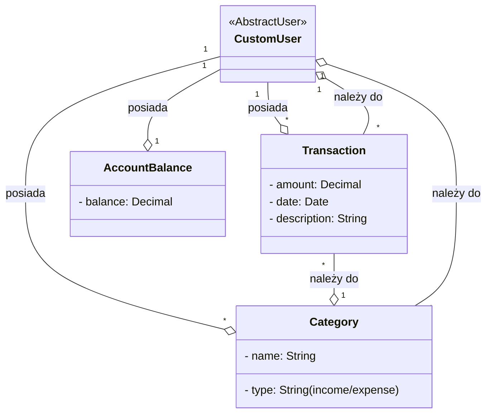

# Aplikacja do zarządzania wydatkami

## Spis treści

1. [Opis projektu](#1-opis-projektu)
2. [Struktura katalogów](#2-struktura-katalogów)
3. [Wymagania i instalacja](#3-wymagania-i-instalacja)
4. [Aplikacje i funkcjonalności](#4-aplikacje-i-funkcjonalności)
5. [Modele danych](#5-modele-danych)
    - [Opis modeli](#opis-modeli)
    - [Diagram UML](#diagram-uml)
6. [Uwierzytelnianie i autoryzacja](#6-uwierzytelnianie-i-autoryzacja)
7. [Interfejs użytkownika](#7-interfejs-użytkownika)
8. [Testowanie](#8-testowanie)
9. [Deployment](#9-deployment)
10. [Załączniki](#10-załączniki)
11. [Opis widoków](#opis-widoków)

---

## 1. Opis projektu

Aplikacja Django do zarządzania budżetem osobistym i domowym. Użytkownicy mogą tworzyć konta, kategorie wydatków, dodawać przychody i wydatki, a także przeglądać raporty finansowe.

---

## 2. Struktura katalogów

```
budget_managment_app_django-main/
│
├── budget_managment_app/        # Główna aplikacja Django
│   ├── accounts/                # Zarządzanie kontami użytkowników
│   ├── budget/                  # Obsługa budżetów
│   ├── categories/              # Kategorie wydatków i przychodów
│   ├── core/                    # Konfiguracja główna (settings, urls)
│   ├── static/                  # Statyczne zasoby (CSS, JS)
│   ├── templates/               # Szablony HTML
│   ├── tests/                   # Testy jednostkowe i integracyjne
│   └── manage.py                # Uruchamianie projektu
├── requirements/                # Pliki z zależnościami
├── .gitignore
├── README.md
└── pytest.ini
```

---

## 3. Wymagania i instalacja

**Wymagania systemowe:**
- Python 3.8+
- Django 4.x
- pip

**Instalacja:**
```bash
git clone <repo>
cd budget_managment_app_django-main
python -m venv venv
source venv/bin/activate  # Linux/macOS
venv\Scripts\activate     # Windows
pip install -r requirements/base.txt
python manage.py migrate
python manage.py createsuperuser
python manage.py runserver
```

---

## 4. Aplikacje i funkcjonalności

### `accounts/`
- Rejestracja, logowanie, zarządzanie kontem użytkownika
- Resetowanie hasła
- Uprawnienia dostępu

### `budget/`
- Tworzenie budżetów 
- Dodawanie przychodów i wydatków
- Saldo i limity

### `categories/`
- Tworzenie kategorii przychodów/wydatków

---

## 5. Modele danych i relacje

Poniżej znajdują się rzeczywiste relacje między modelami w aplikacji:

### Relacje między modelami

- **Transaction (Transakcja)**
  - `user` – klucz obcy do modelu użytkownika (`CustomUser`), relacja wiele-do-jednego
  - `category` – klucz obcy do modelu `Category`, relacja wiele-do-jednego

- **Category (Kategoria)**
  - `user` – klucz obcy do modelu użytkownika (`CustomUser`), relacja wiele-do-jednego

- **AccountBalance (Saldo konta)**
  - `user` – relacja jeden-do-jednego z modelem użytkownika (`CustomUser`)

- **CustomUser**
  - Dziedziczy po `AbstractUser`

#### Podsumowanie relacji

- Jeden użytkownik (`CustomUser`) posiada wiele transakcji (`Transaction`)
- Jeden użytkownik (`CustomUser`) posiada wiele kategorii (`Category`)
- Jedna transakcja (`Transaction`) należy do jednej kategorii (`Category`)
- Każdy użytkownik (`CustomUser`) ma jedno saldo konta (`AccountBalance`)

### Opis modeli

- **Category**  
  Reprezentuje kategorię transakcji (np. "Jedzenie", "Transport"). Każda kategoria posiada nazwę, typ (przychód lub wydatek) oraz jest powiązana z użytkownikiem.

    - `name` – nazwa kategorii
    - `type` – typ: przychód (`income`) lub wydatek (`expense`)
    - `user` – właściciel kategorii (relacja do modelu użytkownika)

- **Transaction**  
  Reprezentuje pojedynczą transakcję finansową (przychód lub wydatek), przypisaną do danej kategorii.

    - `category` – powiązanie z kategorią
    - `amount` – kwota transakcji
    - `date` – data transakcji
    - `description` – opcjonalny opis

#### Diagram UML



---

## 6. Uwierzytelnianie i autoryzacja

- Django Auth
- Middleware chroniący dostęp do widoków budżetu i transakcji
- System rejestracji i aktywacji kont

---

## 7. Interfejs użytkownika

- Szablony HTML (Django templates)
- System bazowy oparty o `base.html`
- Widoki klasowe i funkcyjne (`views.py`)
- Stylizacja przy użyciu CSS (możliwie Bootstrap)

---

## 8. Testowanie

- `pytest` jako główne narzędzie testowe (`pytest.ini`)
- Testy jednostkowe w katalogu `tests/`
- Możliwość testowania modeli, widoków, formularzy

---

## 9. Deployment

**Rekomendowane środowisko:**
- Serwer Ubuntu/Debian
- Gunicorn + Nginx
- Baza danych PostgreSQL
- Użycie `.env` do konfiguracji produkcyjnej

**Podstawowe kroki:**
- Ustawienie `ALLOWED_HOSTS`, `DEBUG=False`
- Wdrożenie z użyciem `gunicorn` lub `uwsgi`
- Konfiguracja bazy danych w `settings.py`

---

## 10. Załączniki

- `README.md` – podstawowy opis projektu
- `requirements` – wymagane pakiety

---

## 11. Opis widoków

### accounts/views.py  
([Zobacz kod na GitHubie](https://github.com/Nixir-hub/budget_managment_app_django/blob/52b0ec655d5a14a48b273b0b943a1200d6905883/budget_managment_app/accounts/views.py))

- **RegisterView** – rejestracja nowego użytkownika, tworzy domyślne saldo i kategorię systemową "Saldo".
- **UserUpdateView** – edycja danych aktualnie zalogowanego użytkownika.
- **UserDeleteView** – usunięcie aktualnie zalogowanego użytkownika.
- **IndexView** – widok szablonu bazowego (base.html).
- **AccountBalanceUpdateView** – edycja salda użytkownika.

---

### budget/views.py  
([Zobacz kod na GitHubie](https://github.com/Nixir-hub/budget_managment_app_django/blob/52b0ec655d5a14a48b273b0b943a1200d6905883/budget_managment_app/budget/views.py))

- **TransactionListView** – lista transakcji użytkownika (z filtrami po kategorii i dacie).
- **TransactionCreateView** – dodanie nowej transakcji (przychód/wydatek).
- **TransactionUpdateView** – edycja istniejącej transakcji.
- **TransactionDeleteView** – usunięcie transakcji należących do użytkownika.
- **BalanceSummaryView** – podsumowanie przychodów, wydatków i bilansu za bieżący miesiąc.
- **ExpenseChartView** – generuje wykres wydatków z ostatnich 6 miesięcy.

---

### categories/views.py  
([Zobacz kod na GitHubie](https://github.com/Nixir-hub/budget_managment_app_django/blob/52b0ec655d5a14a48b273b0b943a1200d6905883/budget_managment_app/categories/views.py))

- **CategoryListView** – lista kategorii użytkownika.
- **CategoryCreateView** – dodanie nowej kategorii.
- **CategoryUpdateView** – edycja kategorii użytkownika (z blokadą dla kategorii systemowych).
- **CategoryDeleteView** – usuwanie wybranej kategorii (z blokadą dla kategorii systemowych).

---
